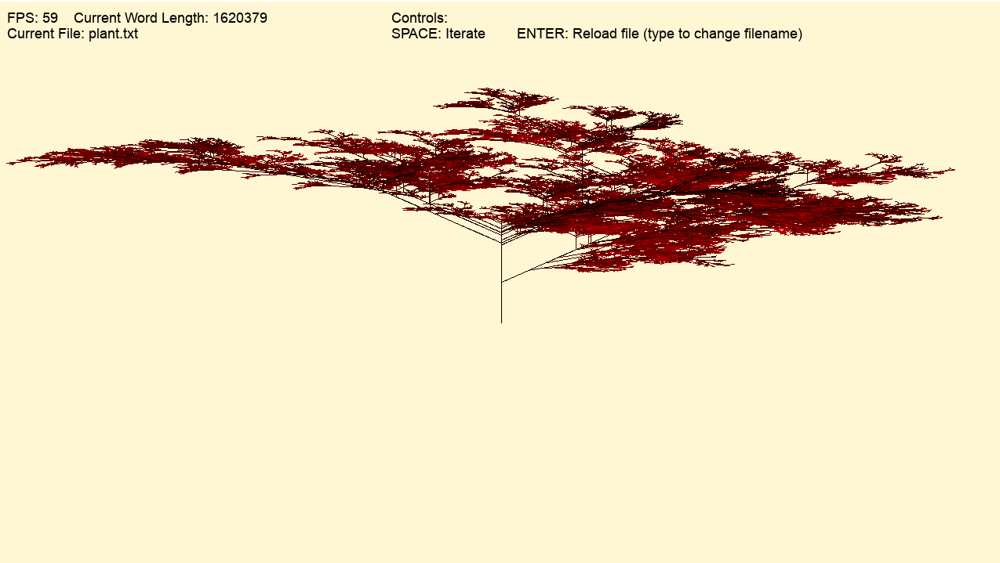
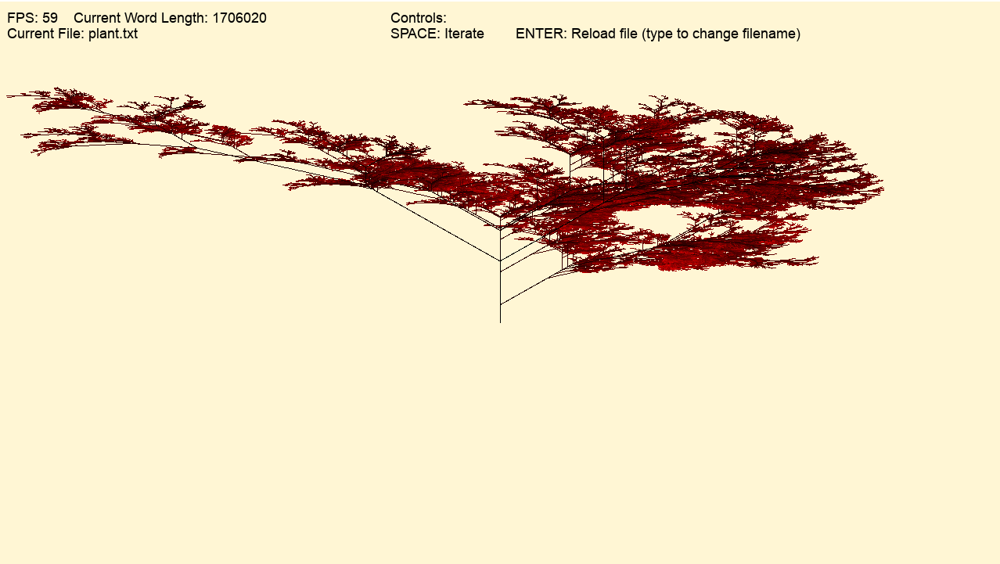
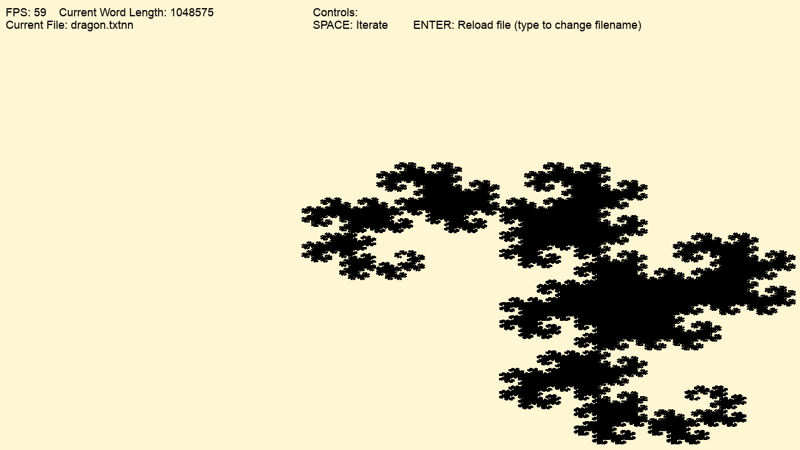
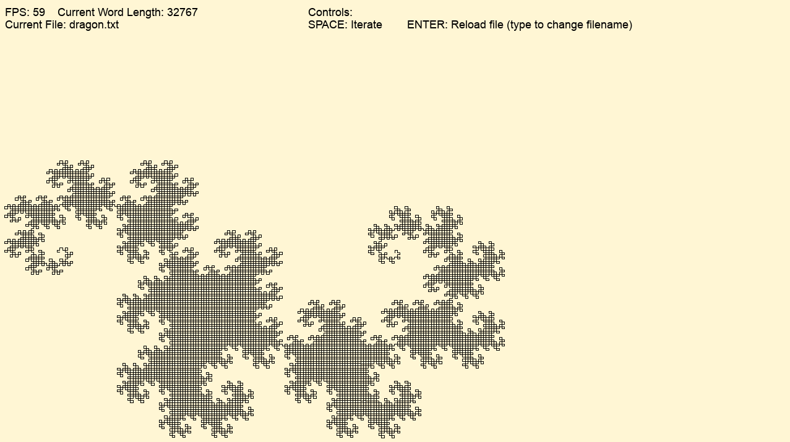
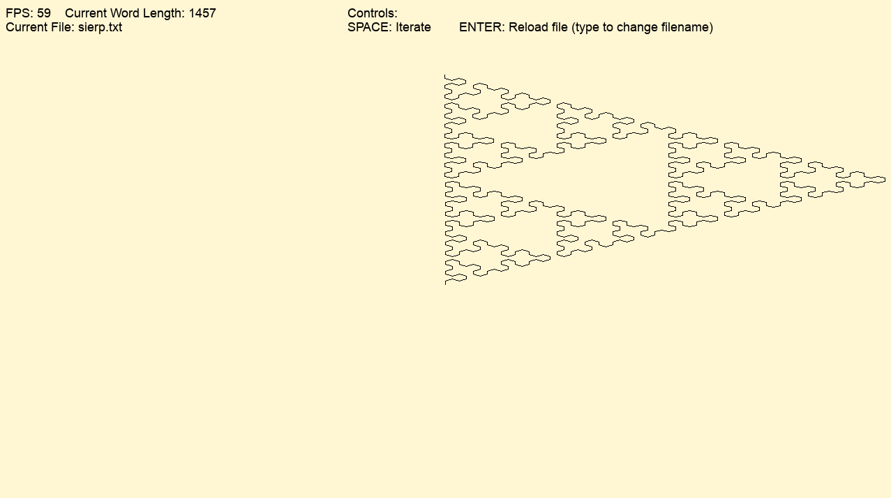
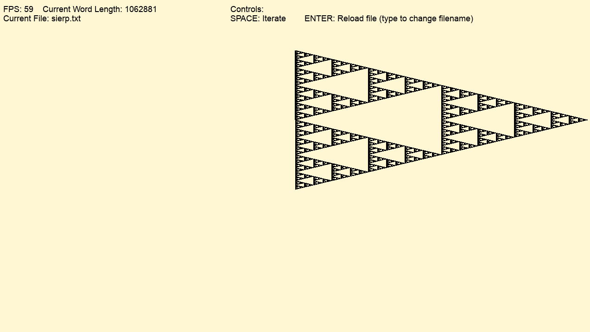

# LTree - A Visualizer for L-System Fractals
This project is a simple parser and visualizer for l-system grammars.  It is written in C++, and uses SDL to draw the graphics.  L-Systems are a type of formal grammar that allow modelling of a variety of self similar fractals.  This application allows the user to create and visualize specific morphologies of these systems.  It uses a 2D "pen" to draw on "draw" variables specified by the system.  It also is able to show the depth of a given branch within a system using color.

## Building + Running
This project uses MSVC.  To compile the program, you will need Visual Studio 2022, with Visual C/C++ support installed.  Run the following:
```
> .\build.bat
```
The executable will be located in the `out\` directory.  Because the executable relies on some resources in the `data\` directory, it must be run from there:
```
> cd data\
> ..\out\ltree.exe
```

## Usage
The application is straightforward, requiring an input file describing the l-system.  Some sample files have been provided in the `data\` directory for reference.  To change the input file, simply enter it into the application, and hit enter to reload the grammar.  The system definition files are in the following format (with C-style comments for clarity):
```
r // Optional line, will randomize grammar expansion
<number> // Angle the + and - operators will turn the pen
[draw variables] // Variables that will cause the pen to draw
<starting word> // Initial word used
<variable>-><expansion> // Rules used to expand grammar.  For each variable used in the grammar, there must be a rule.
... // There can be as many as the user desires
```
Currently, the application does not check that the grammar is well defined, although this may be added in the future.

## Examples
Here are some examples of the system's results:
### `plant.txt`


### `dragon.txt`


### `sierp.txt`

